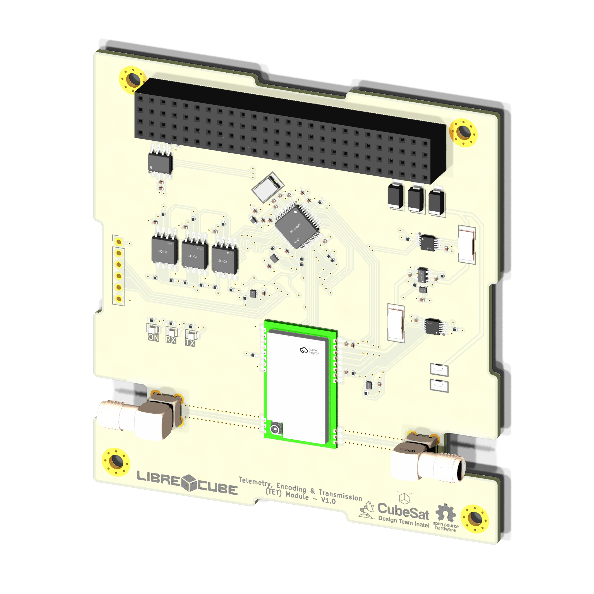
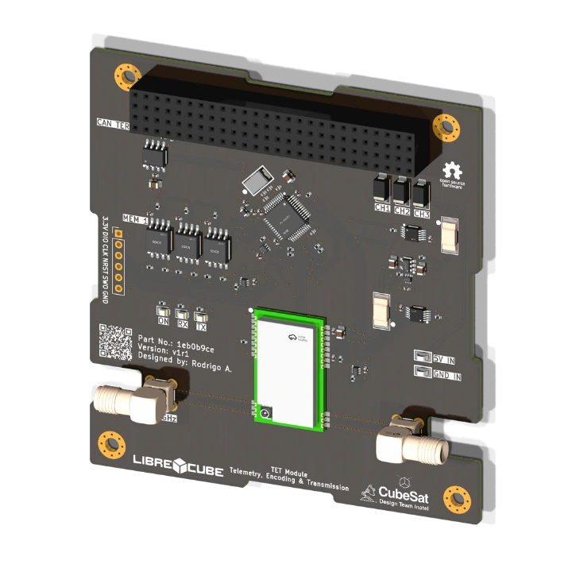

  

<h1 align="center">TET Module</h1>

    
    
    
    
    

    <a href="#overview">Overview</a> •
    <a href="#repository-organization">Repository Organization</a> •
    <a href="#releases">Releases</a> •
    <a href="#references">References</a> •
    <a href="#license">License</a>

## Overview
This project involves the development of the **TET (Telemetry, Encoding & Transmission)** module tailored for a 1U CubeSat platform. The system is engineered to handle TT&C (Tracking, Telemetry, and Command) capabilities, providing long-range telemetry and low-power wireless communication based on the Semtech LR1121 RF transceiver architecture and an STM32L431 microcontroller.

    

**Technical Parameters**
- **RF Architecture:** E80-900M2213S (LR1121)
- **Supported Bands:** Dual-band operation (915 MHz and 2.4 GHz)
- **Modulation Schemes:** LoRa, GFSK, FLRC, and LR-FHSS.
- **RF Interfaces:** Dedicated SMA/IPEX outputs for external antennas
- **External Interfaces:** SPI, GPIO, and CAN bus (via TCAN3414).
- **Power Input:** 3 independent 5 V input channels from the EPS (via PC/104)
- **Power Regulation:** Independent, regulated low-noise 3.3 V rail.
- **Onboard Sensors:** INA226 (current and voltage monitoring) and TMP112 (temperature monitoring and thermal alerts via I2C).
- **Storage:** 3 external SPI flash memories configured with TMR (Triple Modular Redundancy) for telemetry buffering and data storage.

## Repository Organization

* `docs`: Technical documentation and datasheets.
* `hardware`: Core hardware files.
    * `3D`: 3D models (.step).
    * `Fabrication`: BOM and Gerber files for JLCPCB manufacturing.
    * `PCB`: KiCad schematics and layout design.
* `firmware`: Examples of firmware implementation.

## Releases

<table>
  <thead>
    <tr>
      <th>Render</th>
      <th>Board Name</th>
      <th>Status</th>
      <th>Latest Release</th>
      <th>Date</th>
      <th></th>
      <th></th>
      <th>Datasheet</th>
      <th>BOM</th>
      <th>Ordering Info</th>
    </tr>
  </thead>
  <tbody>
    <tr>
      <td></td>
      <td>TET Module v0r1</td>
      <td>🧪 Testing</td>
      <td><a href="#">v0r1</a></td>
      <td>09-06-2026</td>
      <td></td>
      <td></td>
      <td><a href="#">PDF</a></td>
      <td>Yes</td>
      <td><a href="#">GERBER</a> (JLCPCB)</td>
    </tr>
  </tbody>
</table>

## References

**Missions Associated with this Project**

  
  
  

## License

This project is licensed under the permissive, weakly-reciprocal **[CERN-OHL-W-2.0](LICENSE)** open-hardware license. You are free to modify and distribute these files, provided downstream hardware design modifications remain under the same terms.